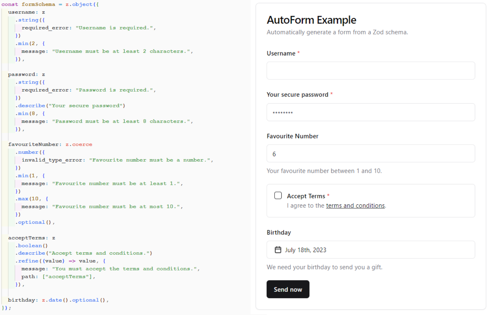

# &lt;AutoForm /&gt; for @shadcn/ui

AutoForm is a React component that automatically creates a @shadcn/ui form based on a zod schema.

A live demo can be found at <https://vantezzen.github.io/auto-form/>.



## When to use AutoForm?

AutoForm is mostly meant as a drop-in form builder for your internal and low-priority forms with existing zod schemas. For example, if you already have zod schemas for your API and want to create a simple admin panel to edit user profiles, simply pass the schema to AutoForm and you're done.

AutoForm uses @shadcn/ui components as natively as possible with only minimal class overrides. This way, if you have customized your @shadcn/ui components in your project, AutoForm should not interfere with your customizations.

As forms almost always grow more complex, AutoForm gives you options to customize how forms are rendered (e.g. using the `fieldConfig` options and dependency support) and gives you escape hatches to customize the form even further (e.g. rendering custom parents and adding custom field types).

However, AutoForm does not aim to be a full-featured form builder. It does not aim to support every edge case in your zod schema or allow building complex, multi-page forms. If you need more customization, feel free to customize AutoForm's renderer in your project or use more powerful form builders like [Formik](https://formik.org/) - though those require more specialized configuration instead of simple drop-in support for your zod schema. For an example on how AutoForm can be extended for more powerful, YAML-based, multi-page forms, see [AutoForm YAML](https://github.com/roeyazroel/auto-form).

## Installation

### Custom registry

If you are using @shadcn/ui 2.0.0 or later, you can install the component directly from the registry. Unfortunately, custom registries currently don't directly support subfolders, so we are using a workaround to install the component.

```bash
npx shadcn@latest add https://raw.githubusercontent.com/vantezzen/auto-form/main/registry/auto-form.json
```

### Manual installation

The component depends on the following components from shadcn/ui:

- accordion
- button
- calendar
- card
- checkbox
- form
- input
- label
- popover
- radio-group
- select
- separator
- switch
- textarea
- tooltip
- toggle

You can install them all at once with:

```bash
npx shadcn@latest add accordion button calendar card checkbox form input label popover radio-group select separator switch textarea tooltip toggle
```

To install the component itself, copy the `auto-form` folder and `date-picker.tsx` from `src/components/ui` to your project's ui folder.

You can remove the tests folder in `auto-form/tests`.

## Field types

Currently, these field types are supported out of the box:

- boolean (checkbox, switch)
- date (date picker)
- enum (select, radio group)
- number (input)
- string (input, textfield)

You can add support for other field types by adding them to the `INPUT_COMPONENTS` object in `auto-form/config.tsx`.

## Usage

Basic usage:

```tsx
"use client";
import AutoForm, { AutoFormSubmit } from "./components/ui/auto-form";
import * as z from "zod";

// Define your form schema using zod
const formSchema = z.object({
  username: z
    .string({
      required_error: "Username is required.",
    })
    // You can use zod's built-in validation as normal
    .min(2, {
      message: "Username must be at least 2 characters.",
    }),

  password: z
    .string({
      required_error: "Password is required.",
    })
    // Use the "describe" method to set the label
    // If no label is set, the field name will be used
    // and un-camel-cased
    .describe("Your secure password")
    .min(8, {
      message: "Password must be at least 8 characters.",
    }),

  favouriteNumber: z.coerce // When using numbers and dates, you must use coerce
    .number({
      invalid_type_error: "Favourite number must be a number.",
    })
    .min(1, {
      message: "Favourite number must be at least 1.",
    })
    .max(10, {
      message: "Favourite number must be at most 10.",
    })
    .default(5) // You can set a default value
    .optional(),

  acceptTerms: z
    .boolean()
    .describe("Accept terms and conditions.")
    .refine((value) => value, {
      message: "You must accept the terms and conditions.",
      path: ["acceptTerms"],
    }),

  // Date will show a date picker
  birthday: z.coerce.date().optional(),

  sendMeMails: z.boolean().optional(),

  // Enum will show a select
  color: z.enum(["red", "green", "blue"]),

  // Create sub-objects to create accordion sections
  address: z.object({
    street: z.string(),
    city: z.string(),
    zip: z.string(),
  }),
});

function App() {
  return (
    <AutoForm
      // Pass the schema to the form
      formSchema={formSchema}
      // You can add additional config for each field
      // to customize the UI
      fieldConfig={{
        password: {
          // Use "inputProps" to pass props to the input component
          // You can use any props that the component accepts
          inputProps: {
            type: "password",
            placeholder: "••••••••",
          },
        },
        favouriteNumber: {
          // Set a "description" that will be shown below the field
          description: "Your favourite number between 1 and 10.",
        },
        acceptTerms: {
          inputProps: {
            required: true,
          },
          // You can use JSX in the description
          description: (
            <>
              I agree to the{" "}
              <a
                href="#"
                className="text-primary underline"
                onClick={(e) => {
                  e.preventDefault();
                  alert("Terms and conditions clicked.");
                }}
              >
                terms and conditions
              </a>
              .
            </>
          ),
        },

        birthday: {
          description: "We need your birthday to send you a gift.",
        },

        sendMeMails: {
          // Booleans use a checkbox by default, you can use a switch instead
          fieldType: "switch",
        },
      }}
      // Optionally, define dependencies between fields
      dependencies={[
        {
          // Hide "color" when "sendMeMails" is not checked as we only need to
          // know the color when we send mails
          sourceField: "sendMeMails",
          type: DependencyType.HIDES,
          targetField: "color",
          when: (sendMeMails) => !sendMeMails,
        },
      ]}
    >
      {/* 
      Pass in a AutoFormSubmit or a button with type="submit".
      Alternatively, you can not pass a submit button
      to create auto-saving forms etc.
      */}
      <AutoFormSubmit>Send now</AutoFormSubmit>

      {/*
      All children passed to the form will be rendered below the form.
      */}
      <p className="text-gray-500 text-sm">
        By submitting this form, you agree to our{" "}
        <a href="#" className="text-primary underline">
          terms and conditions
        </a>
        .
      </p>
    </AutoForm>
  );
}
```

### Next.js and RSC

AutoForm can only be used inside a client-side React component due to serialization of the zod schema and values to your event listeners. If you want to use it in a Next.js app, simply mark your component with "use client":

```tsx
// MyPage.tsx
export default function MyPage() {
  return (
    <div>
      <MyForm />
    </div>
  );
}

// MyForm.tsx
"use client";
import AutoForm from "./components/ui/auto-form";
export default function MyForm() {
  return <AutoForm onSubmit={...} ... />;
}
```

### Zod configuration

#### Validations

Your form schema can use any of zod's validation methods including refine.

Autoform is able to automatically transform some of zod's validation elements into HTML attributes. For example, if you use `zod.string().min(8)`, the input will automatically have a `minlength="8"` attribute.

Validation methods that are not supported by HTML will automatically be checked when the form is submitted.

#### Descriptions

You can use the `describe` method to set a label and description for each field. If no label is set, the field name will be used and un-camel-cased.

```tsx
const formSchema = z.object({
  username: z.string().describe("Your username"),
  someValue: z.string(), // Will be "Some Value"
});
```

#### Coercion

When using numbers and dates, you should use coerce. This is because input elements may return a string that should automatically be converted.

```tsx
const formSchema = z.object({
  favouriteNumber: z.coerce.number(),
  birthday: z.coerce.date(),
});
```

#### Optional fields

By default, all fields are required. You can make a field optional by using the `optional` method.

```tsx
const formSchema = z.object({
  username: z.string().optional(),
});
```

#### Default values

You can set a default value for a field using the `default` method.

```tsx
const formSchema = z.object({
  favouriteNumber: z.number().default(5),
});
```

If you want to set default value of date, convert it to Date first using `new Date(val)`.

#### Sub-objects

You can nest objects to create accordion sections.

```tsx
const formSchema = z.object({
  address: z.object({
    street: z.string(),
    city: z.string(),
    zip: z.string(),

    // You can nest objects as deep as you want
    nested: z.object({
      foo: z.string(),
      bar: z.string(),

      nested: z.object({
        foo: z.string(),
        bar: z.string(),
      }),
    }),
  }),
});
```

Like with normal objects, you can use the `describe` method to set a label and description for the section:

```tsx
const formSchema = z.object({
  address: z
    .object({
      street: z.string(),
      city: z.string(),
      zip: z.string(),
    })
    .describe("Your address"),
});
```

#### Select/Enums

AutoForm supports `enum` and `nativeEnum` to create select fields.

```tsx
const formSchema = z.object({
  color: z.enum(["red", "green", "blue"]),
});

enum BreadTypes {
  // For native enums, you can alternatively define a backed enum to set a custom label
  White = "White bread",
  Brown = "Brown bread",
  Wholegrain = "Wholegrain bread",
  Other,
}
// Keep in mind that zod will validate and return the enum labels, not the enum values!
const formSchema = z.object({
  bread: z.nativeEnum(BreadTypes),
});
```

#### Arrays

AutoForm supports arrays _of objects_. Because inferring things like field labels from arrays of strings/numbers/etc. is difficult, only objects are supported.

```tsx
const formSchema = z.object({
  guestListName: z.string(),
  invitedGuests: z
    .array(
      // Define the fields for each item
      z.object({
        name: z.string(),
        age: z.coerce.number(),
      })
    )
    // Optionally set a custom label - otherwise this will be inferred from the field name
    .describe("Guests invited to the party"),
});
```

Arrays are not supported as the root element of the form schema.

You also can set default value of an array using .default(), but please makesure the array element has same structure with the schema.

```tsx
const formSchema = z.object({
  guestListName: z.string(),
  invitedGuests: z
    .array(
      // Define the fields for each item
      z.object({
        name: z.string(),
        age: z.coerce.number(),
      })
    )
    .describe("Guests invited to the party")
    .default([
      {
        name: "John",
        age: 24,
      },
      {
        name: "Jane",
        age: 20,
      },
    ]),
});
```

### Field configuration

As zod doesn't allow adding other properties to the schema, you can use the `fieldConfig` prop to add additional configuration for the UI of each field.

```tsx
<AutoForm
  fieldConfig={{
    // Add config for each field here - don't add the field name to keep all defaults
    username: {
      // Configuration here
    },
  }}
/>
```

#### Input props

You can use the `inputProps` property to pass props to the input component. You can use any props that the HTML component accepts.

```tsx
<AutoForm
  fieldConfig={{
    username: {
      inputProps: {
        type: "text",
        placeholder: "Username",
      },
    },
  }}
/>

// This will be rendered as:
<input type="text" placeholder="Username" /* ... */ />
```

Disabling the label of an input can be done by using the `showLabel` property in `inputProps`.

```tsx
<AutoForm
  fieldConfig={{
    username: {
      inputProps: {
        type: "text",
        placeholder: "Username",
        showLabel: false,
      },
    },
  }}
/>
```

#### Field type

By default, AutoForm will use the Zod type to determine which input component to use. You can override this by using the `fieldType` property.

```tsx
<AutoForm
  fieldConfig={{
    sendMeMails: {
      // Booleans use a checkbox by default, use a switch instead
      fieldType: "switch",
    },
  }}
/>
```

The complete list of supported field types is typed. Current supported types are:

- "checkbox" (default for booleans)
- "switch"
- "date" (default for dates)
- "select" (default for enums)
- "radio"
- "textarea"
- "fallback" (default for everything else, simple input field)

Alternatively, you can pass a React component to the `fieldType` property to use a custom component.

```tsx
<AutoForm
  fieldConfig={{
    sendMeMails: {
      fieldType: ({
        label,
        isRequired,
        field,
        fieldConfigItem,
        fieldProps,
      }: AutoFormInputComponentProps) => (
        <FormItem className="flex flex-row items-start space-x-3 space-y-0 rounded-md border p-4">
          <FormControl>
            <Switch
              checked={field.value}
              onCheckedChange={field.onChange}
              {...fieldProps}
            />
          </FormControl>
          <div className="space-y-1 leading-none">
            <FormLabel>
              {label}
              {isRequired && <span className="text-destructive"> *</span>}
            </FormLabel>
            {fieldConfigItem.description && (
              <FormDescription>{fieldConfigItem.description}</FormDescription>
            )}
          </div>
        </FormItem>
      ),
    },
  }}
/>
```

#### Description

You can use the `description` property to add a description below the field.

```tsx
<AutoForm
  fieldConfig={{
    username: {
      description:
        "Enter a unique username. This will be shown to other users.",
    },
  }}
/>
```

You can use JSX in the description.

#### Custom parent component

You can use the `renderParent` property to customize the parent element of the input to add adornments etc.
By default, this is a React fragment.

```tsx
<AutoForm
  fieldConfig={{
    username: {
      renderParent: ({ children }) => (
        <div className="flex items-end gap-3">
          <div className="flex-1">
            {children} // This is the input with label etc.
          </div>
          <div>
            <Button type="button">Check</Button>
          </div>
        </div>
      ),
    },
  }}
/>
```

### Accessing the form data

There are two ways to access the form data:

#### onSubmit

The preferred way is to use the `onSubmit` prop. This will be called when the form is submitted and the data is valid.

```tsx
<AutoForm
  onSubmit={(data) => {
    // Do something with the data
    // Data is validated and coerced with zod automatically
  }}
/>
```

#### Controlled form

You can also use the `values` and `onValuesChange` props to control the form data yourself.

```tsx
const [values, setValues] = useState<Partial<z.infer<typeof formSchema>>>({});

<AutoForm values={values} onValuesChange={setValues} />;
```

Please note that the data is not validated or coerced when using this method as they update immediately.

Alternatively, you can use `onParsedValuesChange` to get updated values only when the values can be validated and parsed with zod:

```tsx
const [values, setValues] = useState<z.infer<typeof formSchema>>({});

<AutoForm values={values} onParsedValuesChange={setValues} />;
```

### Submitting the form

You can use the `AutoFormSubmit` component to create a submit button.

```tsx
<AutoForm>
  <AutoFormSubmit>Send now</AutoFormSubmit>
</AutoForm>
// or
<AutoForm>
  <button type="submit">Send now</button>
</AutoForm>
```

### Adding other elements

All children passed to the `AutoForm` component will be rendered below the form.

```tsx
<AutoForm>
  <AutoFormSubmit>Send now</AutoFormSubmit>
  <p className="text-gray-500 text-sm">
    By submitting this form, you agree to our{" "}
    <a href="#" className="text-primary underline">
      terms and conditions
    </a>
    .
  </p>
</AutoForm>
```

### Dependencies

AutoForm allows you to add dependencies between fields to control fields based on the value of other fields. For this, a `dependencies` array can be passed to the `AutoForm` component.

```tsx
<AutoForm
  dependencies={[
    {
      // "age" hides "parentsAllowed" when the age is 18 or older
      sourceField: "age",
      type: DependencyType.HIDES,
      targetField: "parentsAllowed",
      when: (age) => age >= 18,
    },
    {
      // "vegetarian" checkbox hides the "Beef Wellington" option from "mealOptions"
      // if its not already selected
      sourceField: "vegetarian",
      type: DependencyType.SETS_OPTIONS,
      targetField: "mealOptions",
      when: (vegetarian, mealOption) =>
        vegetarian && mealOption !== "Beef Wellington",
      options: ["Pasta", "Salad"],
    },
  ]}
/>
```

The following dependency types are supported:

- `DependencyType.HIDES`: Hides the target field when the `when` function returns true
- `DependencyType.DISABLES`: Disables the target field when the `when` function returns true
- `DependencyType.REQUIRES`: Sets the target field to required when the `when` function returns true
- `DependencyType.SETS_OPTIONS`: Sets the options of the target field to the `options` array when the `when` function returns true

The `when` function is called with the value of the source field and the value of the target field and should return a boolean to indicate if the dependency should be applied.

Please note that dependencies will not cause the inverse action when returning `false` - for example, if you mark a field as required in your zod schema (i.e. by not explicitly setting `optional`), returning `false` in your `REQURIES` dependency will not mark it as optional. You should instead use zod's `optional` method to mark as optional by default and use the `REQURIES` dependency to mark it as required when the dependency is met.

Please note that dependencies do not have any effect on the validation of the form. You should use zod's `refine` method to validate the form based on the value of other fields.

You can create multiple dependencies for the same field and dependency type - for example to hide a field based on multiple other fields. This will then hide the field when any of the dependencies are met.

# Contributing

Contributions are welcome! Please open an issue or submit a pull request.

1. Fork the repository
1. Clone your fork and install dependencies with `npm install`
1. Run `npm run dev` to start the development server and make your changes
1. Run `npm run fix` to run the formatter and linter
1. Run `npm test` to run the tests
1. Commit your changes and open a pull request

## Adding new components

If you want to add a new component, please make sure to add it to the `INPUT_COMPONENTS` object in `auto-form/config.tsx`.

1. Create a new component in `src/components/ui/auto-form/fields`. You can copy an existing component (like `input.tsx`) as a starting point.
2. Add the component to the `INPUT_COMPONENTS` object in `auto-form/config.tsx` to give it a name.
3. Optionally, add the component name as a default handler for a zod type in `auto-form/config.tsx` under `DEFAULT_ZOD_HANDLERS`.

# License

MIT
